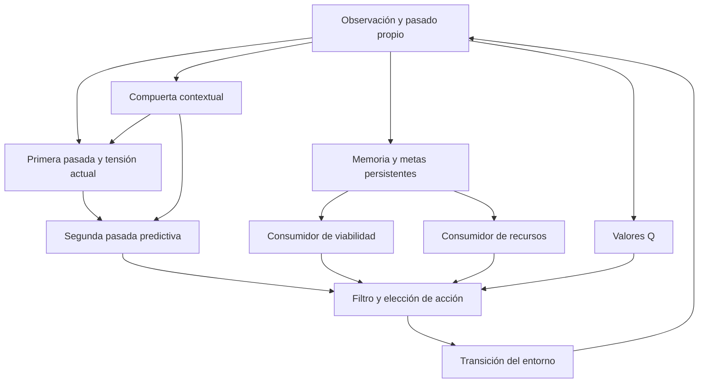

# POLAR R9: ajustes de diseño y experimentos prospectivos

R9 implementa los ocho ajustes del análisis de diseño como una realización
operacional acotada. No es una reproducción numérica de R8 ni implementa la
arquitectura cognitiva completa de 2025. R8 conserva sus fuentes y resultados.
El documento de correspondencia es `r9_completion/DESIGN_R9.md`; el contrato
estadístico es `r9_completion/PREREG_R9.md`.

Fuente publicada antes de ejecutar las 80 semillas finales:
`6f3f739a029cbbab91a00b744bbf562f3bcd3991`.
SHA256 de `r9_completion/FREEZE_R9.json`:
`df2128ec4b394f4a9325c7e53186379bad09d5f7e301756eb3702bf95119243b`.
Es un registro prospectivo de trabajo, no un preregistro externo.

## Resultado de la campaña cerrada

Las 80 semillas completaron 10 240 episodios y 3 276 800 pasos. La auditoría
independiente reconstruyó todos los episodios y coincidió con los seis
contrastes: REL 0/80, GATE 0/80, TENSION 5/80, CONTENT 19/80, GENERIC 9/80
y TRANSFER 0/80; todos los p ajustados por Holm fueron 1. Ninguna hipótesis de
superioridad robusta recibió apoyo. La diferencia media de recompensa frente
al denso en ecología original fue +0.0202, con IC descriptivo 95%
[+0.0022,+0.0433]; este estimando no sustituye el criterio primario.
Sólo 3/80 agentes completos sobrevivieron al final de inventario. Se conservan
estos fallos y los beneficios medios acotados, sin modificar el diseño final.

## Decisión nativa R9



La misma compuerta actúa en ambas pasadas. El modo apagado elimina sus dos
contribuciones cruzadas actuales. Los pronósticos se emiten antes de observar
el resultado de la acción. Predictores, Q, márgenes y coeficientes del gate
quedan congelados en evaluación; memoria episódica y metas siguen su regla
causal predefinida, salvo las lesiones declaradas. Las restricciones predictivas
son heurísticas: respetarlas no garantiza supervivencia física.

## Evidencia y reproducción

El código y los protocolos están en Git. Los archivos de datos se entregan como
`POLAR_R9_EVIDENCE_*.zip`, acompañados por `R9_EVIDENCE_INDEX.json` y
`R9_EVIDENCE_CHECKSUMS.sha256`. Extraer todas las partes en la raíz de una copia
limpia de este repositorio conserva las rutas de `r9_results`. No se incluye
código duplicado en los ZIP. El índice identifica cada archivo y su checksum.

El informe español se entrega como `INFORME_R9.md`. Los resultados completos,
diagnósticos descriptivos y auditorías viven bajo `r9_results`. Los 62 contratos
previos a finales constan en `CONTRACTS_PREFREEZE.txt`; las pruebas posteriores
de utilidades de transporte no son observaciones experimentales adicionales.

```sh
export OPENBLAS_NUM_THREADS=1
export OMP_NUM_THREADS=1
export MKL_NUM_THREADS=1
python -m r9_completion.provenance
python -m r9_tools.audit_parallel --phase final --input r9_results/final/data --workers 6 --replay-seed 952001 --output r9_results/reproduction_audit.json
python -m r9_tools.replay_physics --input r9_results/final/data --seed 952001 --section all --output r9_results/reproduction_physics.json
```

Las salidas de reproducción deben ser nuevas: ningún comando reemplaza la
evidencia original. La auditoría reconstruye endpoints, cálculos y seis
contrastes a partir de trazas; el replay físico usa acciones guardadas, sin
entrenar ni seleccionar otra política. Consulte `r9_completion/REPRODUCIBILITY.md`
para regenerar la campaña con la fuente y autorización originales.

Los controles distinguen funcionamiento, efecto de una lesión, utilidad,
transferencia y afirmaciones sobre conciencia. Ningún resultado de este banco
mide experiencia subjetiva ni valida por sí solo el catálogo filosófico.
